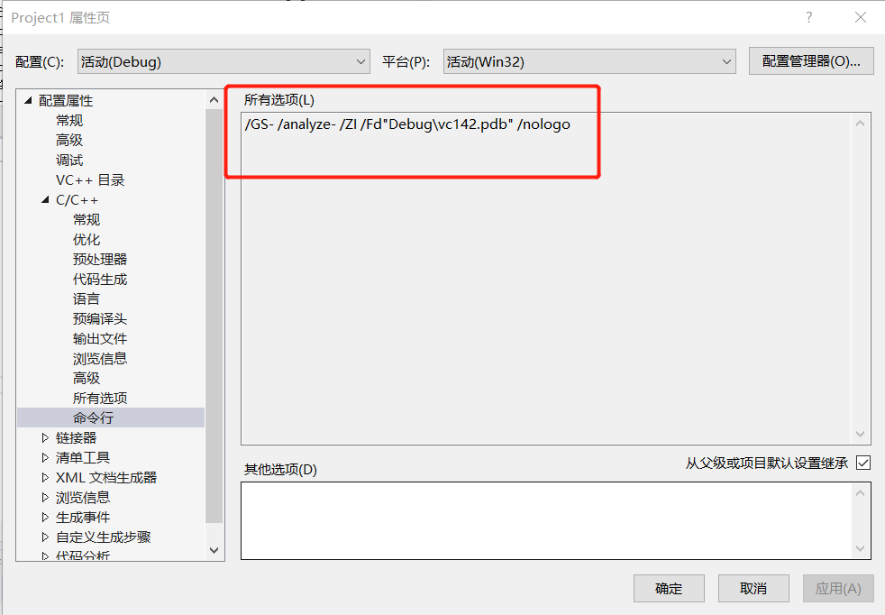
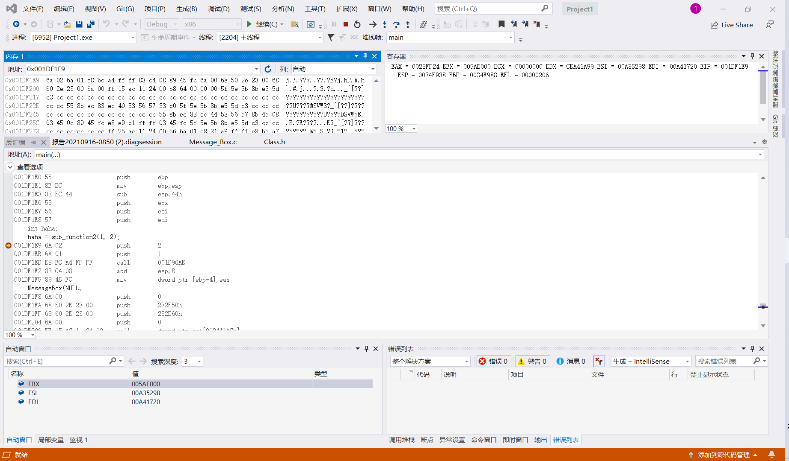
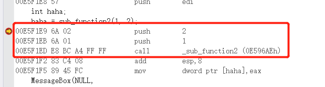
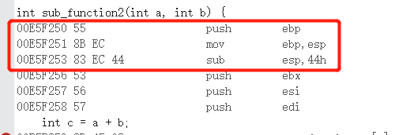
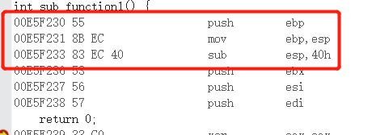
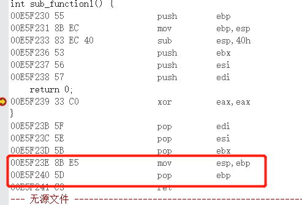
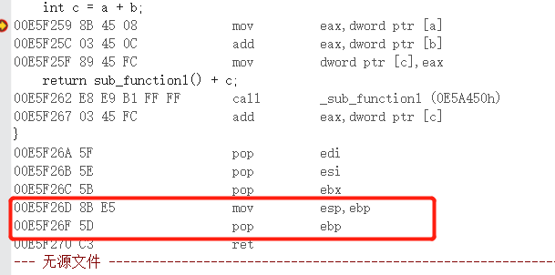
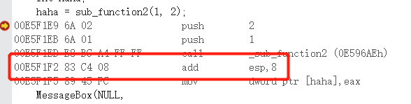

# 逆向工程与软件安全 实验一
### 1. 在vs中建立工程，修改编译选项，只保留 /ZI （调试）和pdb文件路径两个选项，增加禁用安全检查选项(/GS-)。
- 


### 2. 编译多个函数调用的示例代码。

```
#include <Windows.h>
int sub_function1() {
	return 0;
}

int sub_function2(int a, int b) {
	int c = a + b;
	return sub_function1() + c;
}

int main() {
	int haha;
	haha = sub_function2(1, 2);
	MessageBox(NULL,
		"Hello world!",
		"im from cuc",
		MB_OK
	);
	return 100;
}
```


### 3. 下断点调试运行，观察反汇编、寄存器、内存等几个调试时的信息。

- 


### 4. 分析函数调用过程中栈的变化。解释什么是栈帧？ebp寄存器在函数调用过程中的变化过程，ebp寄存器的作用。

- 栈帧也叫过程活动记录，是编译器用来实现过程/函数调用的一种数据结构。 / 也可以理解为，栈帧就是存储在用户栈上的（当然内核栈同样适用），每一次函数调用涉及的相关信息的记录单元。


- ebp寄存器用于保存此时所在栈帧的栈底地址。


### 5. 函数局部变量和参数的保存位置、访问方式是什么。

- 保存在上一个栈帧中，通过[esp+n*4]的方式进行访问


### 6. 多层的函数调用，栈的变化情况，解释未赋初始值的局部变量的值是如何形成的。

- 首先，函数执行时由启动历程调用main函数，此时的ebp是main函数的栈帧底部，esp是main函数的栈帧栈顶，esp随main函数各语句的执行不断滑动。

- 当程序行进至在main函数中调用sub_function2函数时，先将1和2两个参数压入栈中。在此之后，将ebp的值也压入栈中，将栈底寄存器ebp指向栈顶寄存器esp，此时已进入函数sub_function2的栈帧。

  - 
  - 

- 在sub_function_2的栈帧中，将栈顶寄存器esp向上滑动，使其有足够的空间容纳局部变量。当程序行进至调用函数sub_function1时，将此时ebp的值压入栈中，将栈底寄存器ebp指向栈顶寄存器esp，此时已进入函数sub_function1的栈帧。

	- 

- sub_function1的栈帧退栈时，先将栈顶寄存器esp指向栈底寄存器ebp，将epb弹出重新指向sub_function2栈帧的栈底，同时释放形参所占空间（在本示例代码中释放空间为0）。

	- 

- sub_function2的栈帧退栈时，先将栈顶寄存器esp指向栈底寄存器ebp，将ebp弹出重新指向main函数栈帧的栈底，同时释放参数1，2所占空间，此处为8个字节。

	- 

	- 

- 接着继续esp继续滑动，main函数接下来的指令继续运行。

---

- 局部变量通过如下形式赋值。

```
mov (esp+x) (ebp+y)
```